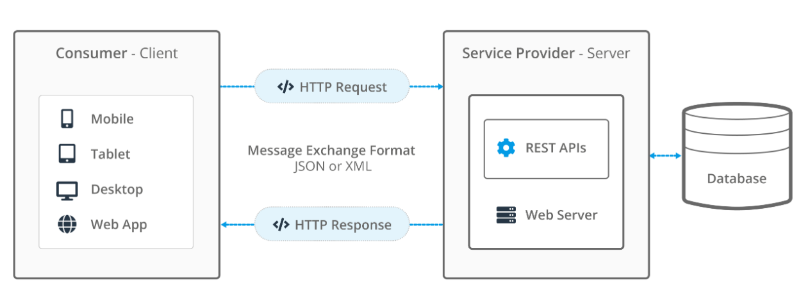

# PT QUIZ — Secure Online Examination System

> **Research project on API Security applied to an Online Multiple-Choice Examination System**

---

## 1. Introduction

**PT Quiz** is a research and development project focused on building a secure online multiple-choice examination system, with an emphasis on studying RESTful API design and information security best practices.

The project simulates a real-world online examination environment by combining a **Web Application** and a **Desktop Application**, both communicating through a central, secured API layer. The system enables users to take multiple-choice quizzes, manage exam data, and process results — all orchestrated through the API.

The primary goal is to research secure API design methodologies and apply them in building a practical demonstration system for studying and research in the field of **Information Security**.

---

## 🌐 Live Demo

| Component | URL | Role |
|---|---|---|
| **Web Client (Student)** | [https://ptquizz.onrender.com/client/](https://ptquizz.onrender.com/client/) | Student (`thisinh`) |
| **Web Server (Admin / Lecturer)** | [https://ptquizz.onrender.com/server/](https://ptquizz.onrender.com/server/) | Lecturer (`giangvien`), Admin |
| **Desktop App (.exe)** | [Download from Google Drive](https://drive.google.com/drive/folders/11VJWaiHnWW4qAy2azdyf_3HjznmvD5CL?usp=sharing) | Student (`thisinh`) |

> The desktop application has been compiled and packaged as a standalone `.exe` file using NetBeans — no Java installation required on the target machine. Simply download and run.

---

## 2. Project Objectives

- Study the concept of APIs and the API programming model.
- Analyze common security threats targeting APIs.
- Apply information security solutions to a real system.
- Build an online examination system consisting of a Web Application and a Desktop Application.
- Design the system to ensure **security**, **data integrity**, and **access control**.

---

## 3. Scope of Research

The project focuses on the following areas:

- Building a RESTful API to facilitate communication between system components.
- Researching authentication and authorization mechanisms (JWT-based).
- Input validation and sanitization to prevent injection attacks.
- Securing API endpoints against unauthorized and malicious access.
- Implementing security logging and activity auditing.

---

## 4. System Architecture

The system follows a **Client–Server** architecture with the API acting as the central intermediary:

<p align="center">
  
</p>

**Components:**

| Component | Role |
|---|---|
| **Web Application** | PHP-based frontend for students and administrators |
| **Desktop Application** | Java-based desktop client for exam-taking |
| **RESTful API (Server)** | Central backend — handles business logic, authentication, and security |
| **Database (MySQL)** | Stores users, questions, exams, and results |

- Both clients communicate exclusively through the API.
- The API is responsible for all business logic and security enforcement.
- The database is never accessed directly by the clients.

---

## 5. Technology Stack

### Web Application (`/client`)
- **PHP** — server-side rendering and API communication
- **HTML / CSS / JavaScript** — frontend structure and interactivity
- **Bootstrap** — responsive UI framework

### Desktop Application (`/java`)
- **Java** — application logic
- **NetBeans IDE** — development environment
- **Swing** — graphical user interface

### API & Backend (`/server`)
- **PHP** — RESTful API implementation
- **JWT (JSON Web Token)** — stateless authentication
- **MySQL / PDO** — database access with prepared statements
- **Composer** — dependency management

### Development Environment
- **XAMPP** (Apache + MySQL)
- **NetBeans IDE**

---

## 6. Key Features

### Web Application (PHP Client)
- User registration and login
- Browse and search available exams
- Take online multiple-choice exams
- Automatic scoring and result display
- Manage questions, question banks, and exams (admin)
- Export results to CSV (admin)
- Import questions from Word documents (admin)
- User management and account status control (admin)
- Premium account upgrade via SePay payment gateway

### Desktop Application (Java Client)
- Authenticate via API (JWT token-based)
- Browse and take exams on a desktop interface
- Synchronize exam results with the server in real-time

---

## 7. Information Security Solutions

The following security techniques have been researched and implemented:

| Security Layer | Implementation |
|---|---|
| **Authentication** | JWT (JSON Web Tokens) with expiry validation |
| **Authorization** | Role-based access control (admin / student) enforced on every API endpoint |
| **Input Validation** | Server-side sanitization of all user inputs to prevent XSS and injection |
| **SQL Injection Prevention** | PDO with prepared statements throughout the entire data layer |
| **API Endpoint Protection** | `.htaccess` rules + token verification middleware (`ApiSecurityValidator.php`) |
| **Security Logging** | `SecurityLogger.php` records suspicious activity and access violations |
| **CSRF Protection** | Anti-CSRF token generation and validation on state-changing requests |
| **Cache-Control Headers** | Sensitive API responses set with `no-store, no-cache` to prevent data leakage |
| **Token Management** | `TokenManager.php` handles JWT signing, parsing, and revocation |

---

## 8. Project Structure

```
project-tracnghiem/
├── client/                   # Web Application (PHP frontend)
│   ├── api/                  # Client-side API call handlers
│   ├── core/                 # Core client utilities
│   ├── public/               # Public assets (CSS, JS, images)
│   ├── routes/               # Client routing
│   ├── views/                # Page templates
│   └── index.php             # Client entry point
│
├── server/                   # RESTful API Backend
│   ├── api/                  # API endpoint handlers (41 endpoints)
│   ├── core/                 # Security core (JWT, Validator, Logger, etc.)
│   ├── controller/           # Business logic controllers
│   ├── model/                # Database models
│   ├── database/             # Database connection
│   ├── routes/               # API routing
│   └── index.php             # API entry point
│
├── java/                     # Desktop Application (Java/Swing)
│   └── JavaGui-ThiTracNghiem-main/
│
├── sepay_webhook.php          # SePay payment webhook handler
└── README.md
```

---

## 9. Getting Started

### ✅ Option A — Use the Hosted Version (Recommended)

No installation needed. Access the system directly online:

| Role | URL |
|---|---|
| **Student** (take exams) | [https://ptquizz.onrender.com/client/](https://ptquizz.onrender.com/client/) |
| **Lecturer / Admin** (manage exams) | [https://ptquizz.onrender.com/server/](https://ptquizz.onrender.com/server/) |

**Desktop Application (.exe):**
- Download the pre-built `.exe` from [Google Drive](https://drive.google.com/drive/folders/11VJWaiHnWW4qAy2azdyf_3HjznmvD5CL?usp=sharing)
- No Java installation required — just run the `.exe` directly
- The app connects to the hosted API automatically

---

### 🛠️ Option B — Run Locally

#### Prerequisites
- XAMPP (Apache + MySQL) installed and running
- Java JDK 8+ and NetBeans IDE (for desktop app)
- Composer (for PHP dependencies)

#### Setup Steps

1. **Clone / copy** the project into your XAMPP `htdocs` directory:
   ```
   C:\xampp\htdocs\project-tracnghiem\
   ```

2. **Import the database** — Import the SQL schema file into MySQL via phpMyAdmin.

3. **Install PHP dependencies** (in the `server/` directory):
   ```bash
   cd server
   composer install
   ```

4. **Start XAMPP** — Make sure Apache and MySQL services are running.

5. **Access the Web Client** (Student):
   ```
   http://localhost/project-tracnghiem/client/
   ```

6. **Access the Web Server** (Lecturer / Admin):
   ```
   http://localhost/project-tracnghiem/server/
   ```

7. **Run the Desktop Application** — Open the Java project in NetBeans and run it, or use the compiled `.exe` from [Google Drive](https://drive.google.com/drive/folders/11VJWaiHnWW4qAy2azdyf_3HjznmvD5CL?usp=sharing).

---

## 10. Authors

This project was developed as an academic research project in the field of **Information Security**, focusing on secure API design and implementation.

---

*Built with PHP · Java · MySQL · JWT · Bootstrap*
